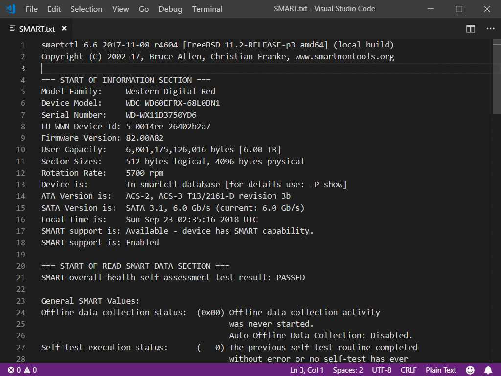

# Render CRLF

This extension shows end-of-line character (CR, LF, or CRLF) when whitespace
rendering is turned on.

## Features

If whitespace rendering is turned on, you will see symbol for either LF (`↓`),
CRLF (`↵`), or CR (`←`).

## Extension Settings

This extension contributes the following settings (compatible with `code-eol`
extension):

* `code-eol.newlineCharacter`: Character used to display LF (line-feed) line
                               ending (aka Linux/Mac line ending).

* `code-eol.returnCharacter`: Character used to display CR (carriage-return)
                              line ending (aka old Macintosh line ending).

* `code-eol.code-eol.crlfCharacter`: Character used to display CRLF
                                     (carriage-return, line-feed) line ending
                                     (aka Windows line ending).

Color is taken from `editorWhitespace.foreground` theme color (also used by
Visual Studio Code to color whitespace symbols).

## Known Issues

### Mixed line-endings are not supported

Visual Studio Code normalizes line endings upon load and thus this extension
will only show one kind of line ending character. Currently it is not possible
to have multiple different line endings (see [issue 127](https://github.com/Microsoft/vscode/issues/127)).

### Not rendering glyphs for large files

For performance reasons Visual Studio Code doesn't synchronise files that are
over 5MB in size (see [issue 27100](https://github.com/Microsoft/vscode/issues/27100)).
Therefore, no line-ending characters will be visible on large files.

## Release Notes

Parsing code is based on https://github.com/jeff-hykin/code-eol that's in turn
based on https://github.com/sohamkamani/code-eol. Major credit goes to them.

### Whats improved?

1. Visibility of EOL is taken from `editor.renderwhitespace` that's conviniently
   controlled by `View`, `Toogle Render Whitespace`.

2. Configuration is dynamically updated upon setting change.

### 1.0.0

Initial release.
